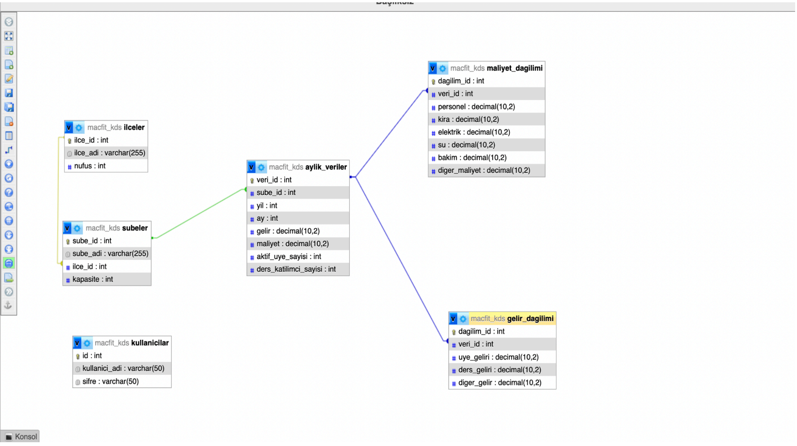

# MacFit KDS Node (MVC)

Bu proje, **Karar Destek Sistemleri (KDS)** dersi kapsamında geliştirilmiş,
Node.js (Express) tabanlı bir **performans ve analiz sistemi**dir.
MVC mimarisi kullanılarak hazırlanmıştır.

---

## 📌 Proje Açıklaması
MacFit şubeleri için performans, harita tabanlı analizler ve yönetimsel
öneriler üreten bir karar destek uygulamasıdır.
Amaç; verileri merkezi olarak analiz ederek yöneticilerin daha hızlı ve
doğru karar almasını sağlamaktır.

---

## 🧩 Senaryo Tanımı
Bu proje, MacFit spor salonu zincirinin İzmir bölgesindeki şube operasyonlarını veriye dayalı bir stratejiyle
yönetebilmek amacıyla geliştirilmiş bir Karar Destek Sistemi (KDS) çözümüdür. Sistemin temel odak noktası; İzmir
ilindeki ilçelerin müşteri yoğunluğu, şube maliyetleri ve gelir performanslarını analiz ederek yöneticilerin yeni şube
açma, mevcut şubeyi iyileştirme veya düşük performanslı şubeleri kapatma kararlarını objektif verilerle almasını
sağlamaktır.

---

## ⚙️ Kurulum Adımları

```bash
git clone https://github.com/OLENAHNATYSHAK/proje.git
cd proje
npm install
npm run dev


## 🗄️ ER Diyagramı

Aşağıda sistemin veritabanı yapısını gösteren ER diyagramı yer almaktadır:




